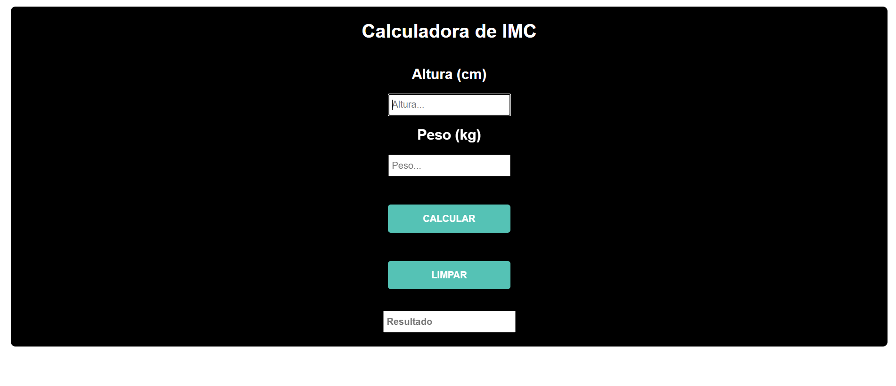

<h1 align="center"> Projeto Javascript - IMC</h1>

Projeto Javascript - IMC

---

 

  

---
## 💻 Tecnologias

Esse projeto foi desenvolvido com as seguintes tecnologias:

- HTML5
- CSS3
- Javascript
- Git e Github

---

## 🚧 Projeto

Projeto de Javascript onde o user digita sua Altura e Peso e o Programa retorna com o IMC. Caso o usuário digite nada o programa pede para o mesmo digitar algo. O programa usa Funções e Seletores de ID e Classes.
Projeto realizado durante a matéria ILP-540 pela Fatec São Paulo. Projeto 1 de 5 projetos que devem ser entregues para complementar a nota do Semestre.

Você pode ver o site nesse link: [Alura Criptografia](https://nigerade.github.io/Alura-Criptografia/)

--- 
